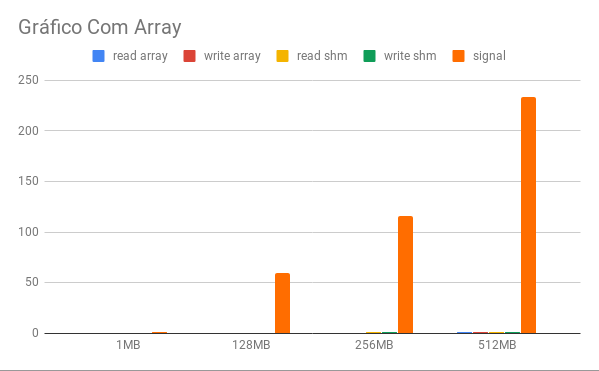
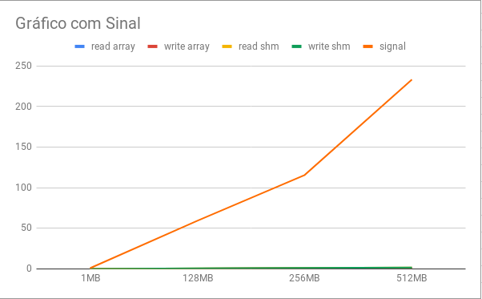
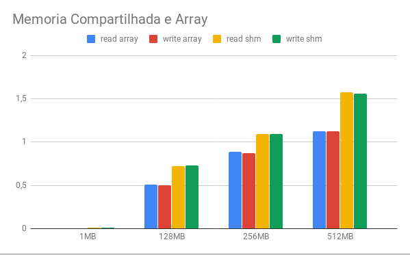
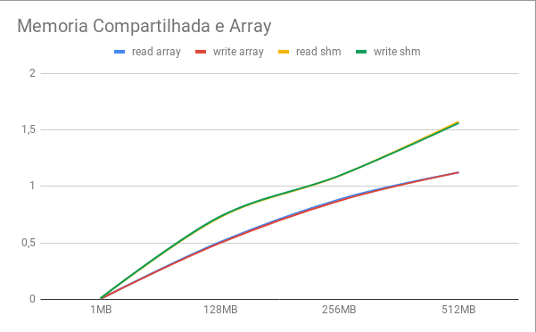

# Experimento de Medição

## Introdução

Esse experimento tem como principal objetivo avaliar o desempenho de tempo entre a leitura e escrita entre processos distintos utilizando memória compartilhada e array, bem como comparar com envio de sinais.

## Metodologia

Foi utilizado o método ``clock_gettime`` da biblioteca time.h com a flag **CLOCK_MONOTONIC_COARSE** para capturar os instantes de tempo, foi utilizado a flag MONOTONIC por ser um contador que não sofre interferencia do usuário e COARSE para termos mais precisão, já que se não utilizado o tempo do SO mudar de modo usuário para modo kernel custaria precisão no tempo calculado.

O programa ``shm.c`` cria uma memória compartilhada e um array e executa a escrita de 1B (char 'a') em toda seu espaço e em seguinda percorre novamente o array verificando se foi de fato foi feito a escrita (essa segunda etapa entendemos que é o tempo de leitura). A execução da escrita/leitura da memória compartilhada e o array ocorrem de forma concorrente utilizando ``fork``

O programa ``signal-get-times.c`` cria dois processos em que um envia sinais e o outro recebe (análogo a arquitetura cliente-servidor). Como só é possivel enviar um inteiro por vez, foi assumido que **um envio de sinal é equivalente a leitura e escrita de 1B em uma memória compartilhada/array**

Foi gerados 1000 amostras desse processo para quatro tamanho de memória distintos: 1MB, 128MB, 256MB e 512MB.

## Resultados

[Planilha](https://docs.google.com/spreadsheets/d/14-sDDpeBVOQDcqk5ZLbbrB74eAsFX99EiQgAd1GUcg4/edit?usp=sharing)

