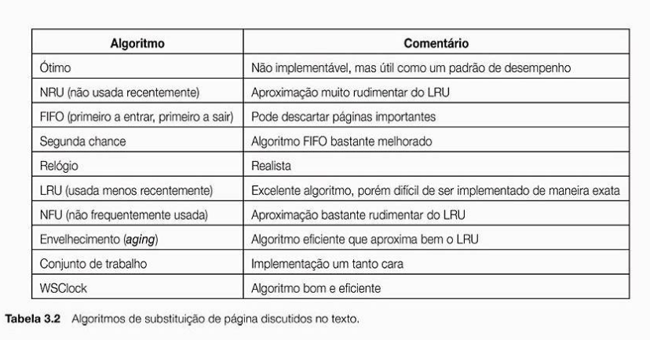

# Algoritmos de alocação de memória

Antes de implementar, verificamos no livro de Tannenbaum, na página 132 a tabela acima e entendemos que a ordem de melhor algoritmo é:

1. Ótimo
2. WSClock
3. Aging
4. LRU
5. Second Chance
6. NRU
7. FIFO
